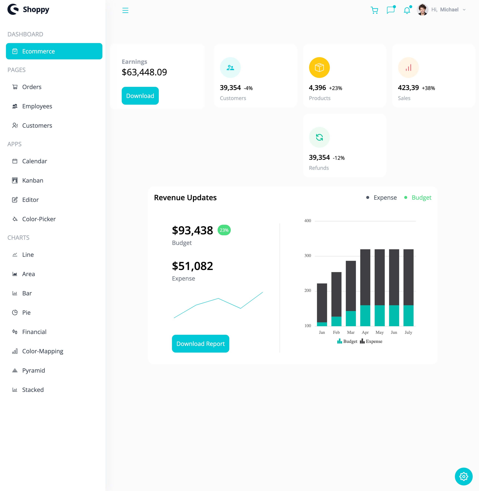

# Learning Experience

My first react app created following along a youtube tutorial. It's not 100% complete as it lacks
a few features and overall is a bit rough around the edges. But that's okay, the goal was not to code up an artificial app that no one is going to use but rather to get a handle on the concept.

The web app itself is a relatively simple dashboard with a sidebar linking out to different sections each including a rich and engaging UI. And all that thanks to react's vast ecosystem of third-party UI component libraries, tools, and resources.

I gained practical insight into react's state management functionality – in particular the context hook, learned the basics on how to implement tailwind, routes, how to structure the project etc.

But what impressed me the most was the convenience of using third-party components like syncfusion: all you have to do is to import the component pass in a few props and there you have it – a great looking and optimized interface spruced up with all the extras you can imagine. As for me, it's only after having being exposed to the sheer power of such libraries that you get to understand what timesaving and efficiency really is.

https://pocdashboard.netlify.app